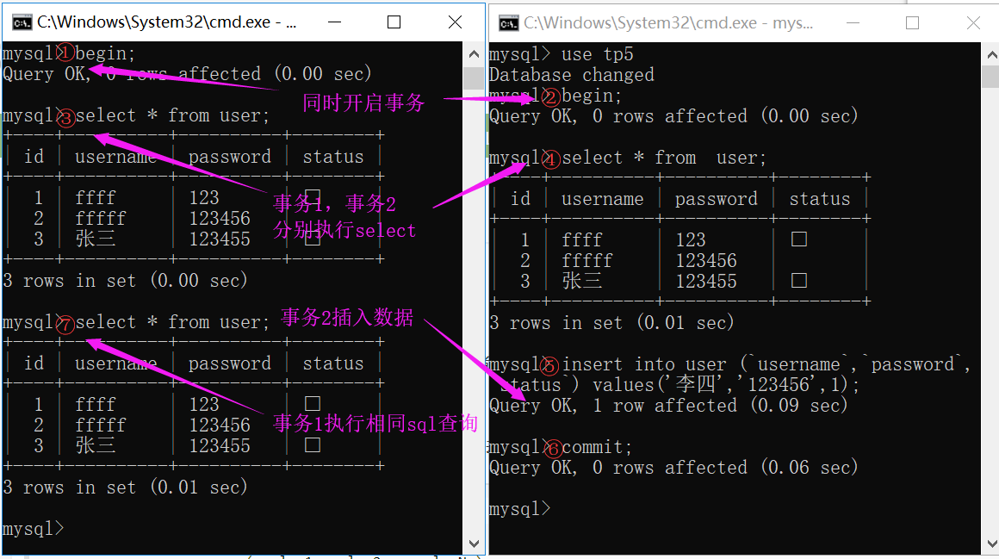

# MySql事务总结

​       

①参考书籍:高性能mysql  
②参考视频:鲁班学院mysql索引以及事务(地址:https://www.bilibili.com/video/av57156557)                 
③参考博客:https://blog.csdn.net/qq_38538733/article/details/88902979


1. 什么是mysql事务？
   事务指的是单个逻辑工作单元执行的一系列操作。mysql 的事务就是一组sql操作(注:增删改查)

2. 事务的特点=>ACID

   1. 原子性(A:atommicity)
      不能分割的最小工作单位。sql操作要么全部成功，要么全部失败
   2. 一致性(C:consistency)
      事务执行完毕，数据库总是从一个状态转化至另外一个状态。
   3. 隔离性(I:isolation)
      一个事务执行成功与否和执行过程，对其他事务不影响
   4. 持久性
      事务一旦执行完毕，数据会永久性的保存在数据库中

3. 如何启动，提交，回滚事务以及自动提交

   ```mysql
   begin;	#开启事务
   rollback; #回滚事务
   commit;  #提交事务
   
   mysql> # 每一条查询操作都是默认开启事务的。除非手动开启一个事务(begin)
   mysql> show variables like 'AUTOCOMMIT'; #自动提交
   +---------------+-------+
   | Variable_name | Value |
   +---------------+-------+
   | autocommit    | ON    |     #默认开始
   +---------------+-------+
   1 row in set, 1 warning (0.00 sec)
   
   ```

4. 隔离级别

   ```mysql
   select @@tx_isolation #当前会话的隔离级别
   select @@global.tx_isolation # 系统当前的隔离级别
   set session transaction isolation level repeatable read; #设置当前会话的隔离级别
   set global transaction isolation level repeatable read; #设置系统的隔离级别
   ```

   隔离的四个级别

   1. 读未提交	read uncommited

      一个事务可以读取到其他事务尚未提交的数据

      一个事务如果对数据有修改，但这个事务尚未提交。修改的数据可以被其他事务读取到。但是这些数据对其他事务来说，可能不是准确的。这样的情况就叫做，脏读。

      ```mysql
      # 假如有记录如下
      mysql> select * from user where id = 1;
      +----+------+------+--------+
      | id | name | role | status |
      +----+------+------+--------+
      |  1 | A    | 1    |      1 |
      +----+------+------+--------+
      事务A和事务B同时进行
      
      +----+-------------+------------+--------+
      |    | 事务A        |事务B       | status |
      +----+-------------+------------+--------+
      |  1 | begin       | begin      |      1 |
      +----+-------------+------------+--------+
      |  2 |             |set status=2|      2 |
      +----+-------------+------------+--------+
      |  3 |select status|            |        |
      |    |(status=2)   |            |      2 |
      +----+-------------+------------+--------+
      |  4 |             |rollback    |       1|
      +----+-------------+------------+--------+
      |  5 |commit       |            |       1|
      +----+-------------+------------+--------+
      如果事务B将status设置成2，事务A可以读到其他事务修改未提交事务的值(就是status=2)。然后事务B回滚事务，status值回滚成1.那么事务A读取到的status=2就是不存在的值。这种情况就是脏读
      
      ```

   2. 读已提交    read commited
      一个事务读取到数据只能是另一个事务已经提交完的数据。这样就可以避免脏读
      read commited级别之下，如果一个事务进行两次查询数据，其间有事务正好对要被查询的数据做了修改并提交了事务，那么两次查询结果是不一致的。这种情况就是不可重复读

   3. 可重复读 repeatable read

      一个事务第一次sql查询数据，那么这些数据被锁定，即使有事务修改了数据并且提交，其他事务执行相同sql语句读取还是第一次sql读取数据。还是会出现幻读。只不过mysql的innoDb通过ReadView和多版本并发控制解决了幻读

      ​		

   4. 串行化serializable


      |                          | 脏读 | 不可重复读 | 幻读 |
      | :----------------------: | :--: | :--------: | :--: |
      | read uncommited 读未提交 |  √   |     √      |  √   |
      |  read commited 读已提交  |  ×   |     √      |  √   |
      | repeatable read 可重复读 |  ×   |     ×      |  √   |
      |   serializable 串行化    |  ×   |     ×      |  ×   |

   多版本并发控制

   

   ​		版本链：每当有一个事务修改某条记录，就复制一份记录用于保存修改的值，并且同时记录两个字段(trx_id,roll_pointer)。trx_id记录事务的id，roll_pointer指向上个事务修改保留的记录(如果是第一个事务修改这记录，则指向原始的那条记录)。

   对于read uncommited ，直接读取版本链的最新数据。

   对于serializable，加锁的方式访问数据库

   对于使用`READ COMMITTED`和`REPEATABLE READ`需要通过`ReadView`进行判断去读取版本链上的数据

[^注]: update、delete、insert修改数据，才会被分配一个事务id，这个事务id是递增的


- Readview
  		活跃的读写事务，把它们的事务id放到一个列表中，我们把这个列表命名为为`m_ids`。

  ​		在read committed(读已提交的)级别下，每次执行select会生成一个readview，然后顺着版本链遍历，直到找到一条版本链的记录，使得它的trx_id不在readview列表m_ids或者等于它本身。那么把这条版本链返回给该事务。如果都没有返回原始的数据。

  ​		在repeatable read(可重复读)级别下， 只会在第一次读取数据才会生成一个ReadView，之后查询不重复生成。顺着版本链查找，找到第一条trx_id等于自己本身的版本链或者第一条比m_ids列表中最小事务id还要小的不活跃事务的版本链。然后这条记录就会被其他事务查询到


工作踩过的坑：

​	场景：订单表order和订单-产品表order_product关联。更新订单的时，事务A更新库存stock，事务B order 以及 order_product。事务B更新order_product表先删除原本购买的产品，将新购买产品的数据插入。事务A要将原先购买产品、新购买的产品数据以及库存做计算在写入数据库。

​	事务A更新库存时 未将select语句包含事务之中，导致读取不到原本产品，多扣库存。


